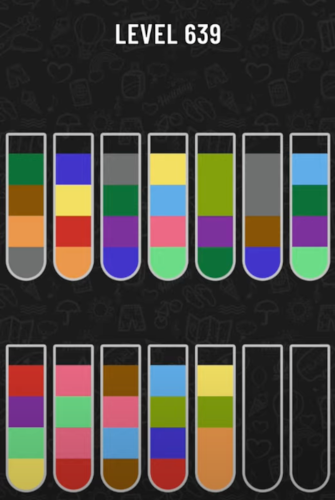

# water-sort-puzzle-solver
Water sort puzzle is a game that player should sort the same colors into bottles and this project provides an optimal solution for given problem using DFS algorithm.

# Usage

1. First you need to clone project.

```git clone https://github.com/cemasma/water-sort-puzzle-solver.git```

2. Build the project.

```go build .```

3. And it is ready to run.

```water-sort-puzzle-solver --file filename```

# How it works?
Solver parses the input json file and after that starts to simulate game mechanics and retries variants by implementation of DFS algorithm until find a solution. You can find example json mapping at below.



```
{
  "bottles": [
    [
      "GRAY",
      "ORANGE",
      "COFFEE",
      "DARK_GREEN"
    ],
    [
      "ORANGE",
      "RED",
      "YELLOW",
      "DARK_BLUE"
    ],
    [
      "DARK_BLUE",
      "PURPLE",
      "DARK_GREEN",
      "GRAY"
    ],
    [
      "LIGHT_GREEN",
      "PINK",
      "BLUE",
      "YELLOW"
    ],
    [
      "DARK_GREEN",
      "PURPLE",
      "GREEN",
      "GREEN"
    ],
    [
      "DARK_BLUE",
      "COFFEE",
      "GRAY",
      "GRAY"
    ],
    [
      "LIGHT_GREEN",
      "PURPLE",
      "DARK_GREEN",
      "BLUE"
    ],
    [
      "YELLOW",
      "LIGHT_GREEN",
      "PURPLE",
      "RED"
    ],
    [
      "RED",
      "PINK",
      "LIGHT_GREEN",
      "PINK"
    ],
    [
      "COFFEE",
      "BLUE",
      "PINK",
      "COFFEE"
    ],
    [
      "RED",
      "DARK_BLUE",
      "GREEN",
      "BLUE"
    ],
    [
      "ORANGE",
      "ORANGE",
      "GREEN",
      "YELLOW"
    ],
    [
      "EMPTY",
      "EMPTY",
      "EMPTY",
      "EMPTY"
    ],
    [
      "EMPTY",
      "EMPTY",
      "EMPTY",
      "EMPTY"
    ]
  ]
}
```

And also there is no limit for bottle count, bottle depth or color count.
